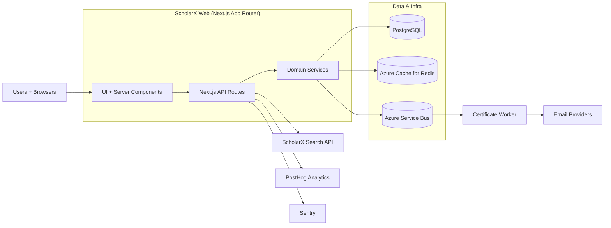

# Architecture

## High-level components
- **Web app:** Next.js App Router UI + server components.
- **API layer:** Next.js API routes that validate inputs and call domain services.
- **Domain services:** Shared business logic for search, courses, certificates, and analytics.
- **Worker:** Background service for certificate rendering and email delivery.
- **Data & infra:** PostgreSQL, Redis, Azure Service Bus, and external providers.

## Repository layout
- `src/app` — UI routes and API route handlers.
- `src/domain` — domain services and infrastructure adapters.
- `src/db/schema` — Drizzle ORM schema definitions.
- `src/worker` — certificate worker pipeline.
- `drizzle/` — generated migrations.
- `docs/` and `specs/` — implementation guides and formal specs.

## Deployment architecture
ScholarX is deployed to Azure Container Apps. The web app and worker are built as separate Docker images and deployed via GitHub Actions for consistent releases.

## Architecture diagram

