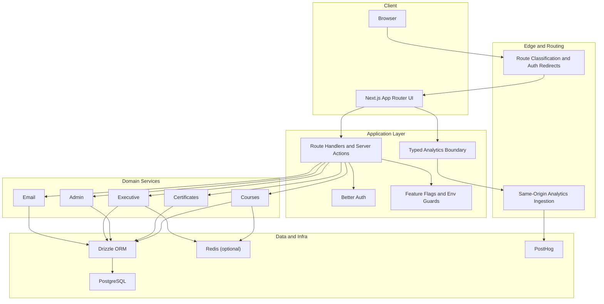

# 🚀 ScholarX

[](https://nextjs.org/)
[](https://react.dev/)
[](https://www.typescriptlang.org/)
[](./TESTING.md)
[](./DEPLOYMENT.md)

ScholarX is a production web platform for scholarship discovery, course learning, and executive operations.

This repository is intentionally engineered as a full-stack product system, not a marketing demo:
- 🌐 Public growth surfaces are isolated from authenticated learner flows and admin operations.
- 🧠 Domain logic lives in typed service boundaries, not UI components.
- 📊 Analytics are governed as product-critical infrastructure with privacy, reconciliation, and fail-open guarantees.
- 🚢 Delivery is automated with migration-aware CI/CD, environment validation, and operational runbooks.

## 🏗️ Why This Codebase Shows Engineering Depth

### 1) 🧱 Architecture with Explicit Boundaries

ScholarX uses Next.js App Router with clear ownership seams:
- `src/app`: routes, layouts, loading states, thin route handlers
- `src/domain`: business modules (admin, courses, certificates, executive, email)
- `src/lib`: cross-cutting adapters (auth, cache, analytics, APIs, rate limits)
- `src/db`: schema and persistence definitions

The design principle is simple: request handlers orchestrate, services decide, repositories persist.

### 2) 🧭 Domain-Oriented Modeling (Not CRUD-Only)

The system models behavior with explicit contracts and policies:
- Course progression and completion policies
- Certificate generation, queueing, storage, and artifact lifecycle
- Executive metric definition, freshness, governance, and export rules
- Email provider abstraction with rate-limiting and delivery classification

This reduces drift between product behavior and implementation details.

### 3) 📈 Reliability-Centered Analytics Governance

Analytics are treated as production infrastructure:
- Canonical event dictionary and KPI mapping contracts
- Same-origin ingestion path support (`/ingest/*`) for resilient client delivery
- Privacy sanitization and forbidden-key filtering
- Fail-open dispatch (user journeys never block on telemetry)
- Curated internal mirror for executive continuity and reconciliation

Governance artifacts and rollout playbooks live in:
- `specs/014-posthog-analytics-governance/`

### 4) ⚡ Performance and Runtime Safety

The platform uses multiple safety levers:
- Server Components by default where appropriate
- Typed boundary validation for params and payloads
- Feature-flag gating for executive and analytics capabilities
- Shared cache abstractions with namespaced keys and test coverage
- Controlled degradation behavior for external dependency failure paths

### 5) 🛠️ Operational Maturity

The repository includes operational capabilities usually missing from early-stage products:
- Web + worker deployment pipelines
- Drizzle migration lifecycle and baseline protections
- Environment validation before build/dev entrypoints
- Security and performance documentation with evidence artifacts
- Executive E2E coverage for growth, quality, finance, and technical health views

## 🗺️ System Architecture



## ✨ Core Capabilities

- 🎓 Public scholarship and opportunity discovery surfaces
- 🤖 AI-assisted opportunity search workflows
- 🔐 Authenticated learner profiles and opportunity actions
- 📚 Course catalog, enrollment, progress, and completion logic
- 🧾 Certificate issuance and retrieval pipeline
- 🧑‍💼 Admin operations and reporting
- 📉 Executive analytics dashboard (growth, funnel quality, finance, technical health)

## 🧩 Stack and Platform Choices

### Application
- Next.js `16.2.6`
- React `19.2.3`
- TypeScript `5`
- Tailwind CSS `4`

### Data and Auth
- Better Auth with Drizzle adapter
- Drizzle ORM
- PostgreSQL
- Redis (cache/rate-limit capability)

### Analytics and Observability
- PostHog (`posthog-js`)
- Sentry (`@sentry/nextjs`)
- Internal executive analytics mirror

### Delivery
- pnpm
- GitHub Actions CI/CD
- Docker standalone output
- Azure Container Apps deployment

## 🗂️ Repository Topology

- `src/app/`: Next.js route tree and API handlers
- `src/domain/`: business domains and contracts
- `src/lib/`: shared platform libraries and adapters
- `src/components/`: shared + feature UI
- `src/db/`: schema and DB integration
- `drizzle/`: migration history
- `tests/e2e/`: executive and product journey tests
- `specs/`: product specs, plans, contracts, rollout artifacts

## 🧪 Local Development

### Prerequisites
- Node.js 22+
- pnpm 10+
- PostgreSQL

### Install
```bash
pnpm install
```

### Configure
- Copy `.env.example` to `.env.local`
- Fill required public and server variables

### Migrate DB
```bash
pnpm db:migrate
```

### Run
```bash
pnpm dev
```

## ✅ Engineering Commands

```bash
pnpm lint
pnpm typecheck
pnpm test
pnpm test:api
```

E2E suite (current pattern in repo):
```bash
node --import tsx --test tests/e2e/**/*.spec.ts
```

## 🗄️ Data and Migration Workflow

```bash
pnpm db:generate
pnpm db:migrate
pnpm db:push
```

`db:migrate` includes baseline migration protections before applying new steps.

## 🔒 Security and Privacy Posture

- Public/auth/admin boundaries are intentionally separated.
- Client bundles use only `NEXT_PUBLIC_*` values.
- Analytics payloads are sanitized before dispatch.
- Sensitive key patterns are filtered from telemetry.
- Admin and internal paths are excluded from public growth instrumentation.

## 🏅 Quality Evidence

- Architecture notes: [ARCHITECTURE.md](./ARCHITECTURE.md)
- System design: [SYSTEM_DESIGN.md](./SYSTEM_DESIGN.md)
- Security notes: [SECURITY.md](./SECURITY.md)
- Testing strategy: [TESTING.md](./TESTING.md)
- Engineering quality: [ENGINEERING_QUALITY.md](./ENGINEERING_QUALITY.md)
- Performance protocol: [PERFORMANCE.md](./PERFORMANCE.md)
- Release process: [RELEASES.md](./RELEASES.md)

## 📚 Selected Reference Specs

- Analytics governance plan: [specs/014-posthog-analytics-governance/plan.md](./specs/014-posthog-analytics-governance/plan.md)
- Analytics contracts: [specs/014-posthog-analytics-governance/contracts/README.md](./specs/014-posthog-analytics-governance/contracts/README.md)
- Executive dashboard spec: [specs/012-executive-dashboard/spec.md](./specs/012-executive-dashboard/spec.md)

## 📄 License

Proprietary. All rights reserved.
