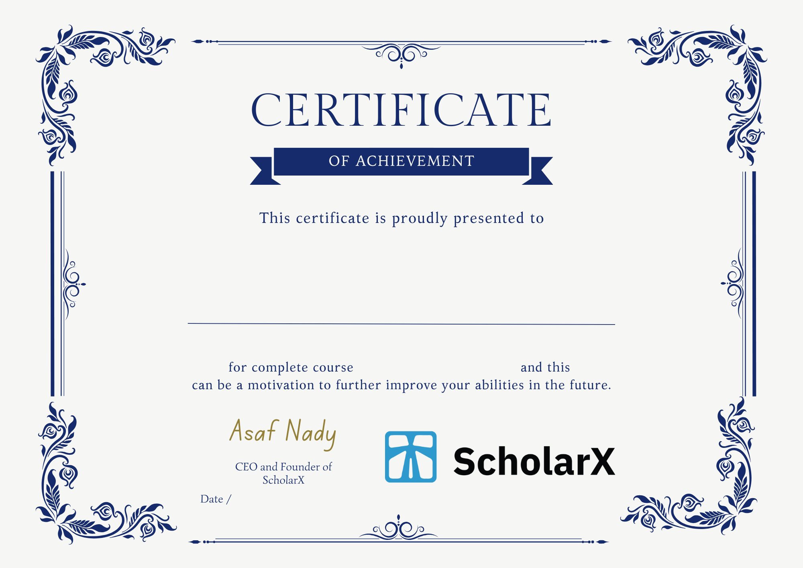
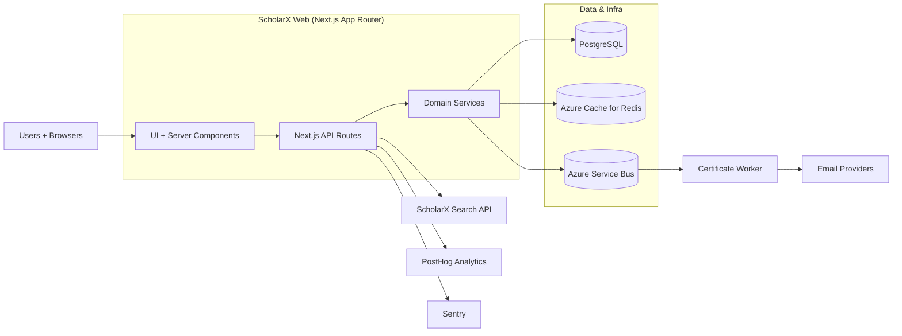

# ScholarX Web

[](https://github.com/ScholarX-Labs/web/actions/workflows/deploy-aca.yml)
[](https://github.com/ScholarX-Labs/web/actions/workflows/deploy-worker-aca.yml)

ScholarX is a premium learning platform that helps students and young professionals discover scholarships, courses, mentorship, and career opportunities. This repository contains the production Next.js web app, the API routes, and the certificate/analytics infrastructure that power the experience.

## Product mission
Empower students globally with accessible education, mentorship, and curated opportunities that remove barriers to upward mobility.

## Live demo
- https://scholarx.app
- AI search: https://scholarx.app/ai-search
- Courses: https://scholarx.app/courses

## Screenshots

| Home | Courses | Certificates |
| --- | --- | --- |
|  |  |  |

## Architecture diagram



## Tech stack
- **Frontend:** Next.js 16 (App Router), React 19, TypeScript, Tailwind CSS, Radix UI, Framer Motion
- **Backend:** Next.js API routes, domain layer services, Zod validation
- **Data:** PostgreSQL + Drizzle ORM, Redis caching (Azure Cache for Redis)
- **Infra:** Docker, Azure Container Apps, Azure Service Bus
- **Observability:** PostHog (product analytics), Sentry (error + perf)
- **Testing:** Node test runner + tsx, Playwright for certificate rendering + e2e

## Main features
- **Courses catalog & enrollment** with category filtering, featured views, and subscription status.
- **AI scholarship/opportunity search** with result normalization, sorting, and caching.
- **Certificate issuance pipeline** with idempotent issuance, PDF rendering, and verification.
- **Admin & executive dashboards** for learning analytics, impact reporting, and operations.
- **Email delivery system** with retry, rate limiting, and provider fallbacks.

## System design & CS fundamentals
### Key flows
1. **AI search** → `/api/opportunities/search` → `searchScholarships` → external search API → cached normalization → UI sorting + pagination.
2. **Certificate issuance** → domain service writes DB + outbox row → Azure Service Bus → worker renders PDF + sends email.
3. **Executive analytics** → event registry + KPI mapping → dashboard aggregation and heatmap bucketing.

### Data structures & algorithms in practice
- **Redis ZSET sliding-window rate limiter** with Lua script (O(log n) per request).
- **Stale‑while‑revalidate caching** with TTL + freshness windows for resilience.
- **Result normalization & ranking** (score/match/percent) and deterministic sorting.
- **Activity heatmap bucketing** for executive dashboards (day/hour histogram).
- **Certificate number generation** with retry on uniqueness collisions.

## Engineering evidence (what proves real software + CS fundamentals)
### Why each feature exists
| Feature | User problem solved | Implementation note |
| --- | --- | --- |
| AI search | Students struggle to find the right scholarship fit. | Normalizes upstream scores + caches results to reduce latency. |
| Courses catalog | Learners need structured, curated learning paths. | API endpoints support list, search, featured, and enroll flows. |
| Certificates | Graduates need proof of achievement. | Idempotent issuance + worker-based PDF generation. |
| Executive analytics | Leaders need visibility into outcomes. | KPI registry + aggregation and heatmaps. |
| Email system | Notifications must be reliable at scale. | Circuit breakers + rate limits + retry policy. |

### Tradeoffs I made
- **External search API vs in-house index:** faster iteration; mitigated with caching, rate limiting, and stale fallback.
- **Fail‑open rate limits for public reads:** preserves UX during Redis outages; sensitive flows use fail‑closed.
- **Server-side caching vs client-only storage:** protects user privacy and reduces upstream traffic.
- **Outbox + worker pipeline vs direct PDF generation:** higher complexity but keeps user-facing latency low.

### Bugs fixed (examples visible in code)
- **TLS handshake failures** avoided by enforcing `sslmode=verify-full` for Postgres connections.
- **Inconsistent ranking** fixed by normalizing multiple score fields into a single match percentage.
- **Upstream API flakiness** handled with stale cache fallbacks and bounded query length.

### Tests I wrote
- Cache semantics + Redis adapter tests (`src/lib/cache/*.test.ts`).
- Rate limiter Lua script + utility tests (`src/lib/rate-limit/*.test.ts`).
- Worker pipeline tests (`src/worker/*.test.ts`).
- Executive analytics e2e coverage (`tests/e2e/*.spec.ts`).

### Performance & reliability improvements
- Redis cache with stale‑while‑revalidate for search and public data.
- Public endpoint rate limiting to protect upstream services.
- Outbox + retry + worker queues for certificate generation.
- Cache metrics and analytics latency tracking for early regression detection.

### What users gained
- Faster search responses with predictable relevance ordering.
- More reliable certificate delivery and verification.
- Clearer impact reporting with executive dashboards.

### What I learned from mistakes
- External dependencies will fail—build graceful degradation from day one.
- SSL defaults vary across environments—make connection intent explicit.

### What I rejected from AI suggestions
- **Client-only caching of search results:** privacy + cache invalidation risks.
- **Emitting raw PII to analytics:** violates governance rules and harms trust.
- **Removing rate limits “for better UX”:** stability beats short-term convenience.

### How I reviewed, refactored, and validated
- Lint + typecheck + test runs; perf regressions tracked via cache metrics.
- Refactored shared cache policy and analytics contracts into typed registries.
- Documented architecture in `/docs` and `/specs` for future maintainers.

## Public architecture documents
- `/docs` — implementation guides, UI specs, and operational playbooks.
- `/specs` — formal specs, plans, and architecture decisions.

## Issue tracking & release notes
- GitHub Issues for backlog + triage.
- Release checklist + changelog templates in `specs/014-posthog-analytics-governance/contracts/`.

## Setup instructions
```bash
corepack enable
pnpm install
cp .env.example .env
pnpm dev
```

## Environment variables
Required for local development (see `.env.example` for the full list):
- `DATABASE_URL` (PostgreSQL connection string)
- `BETTER_AUTH_SECRET`, `BETTER_AUTH_URL`
- `SMTP_*` or `EMAIL_*` variables for email delivery
- `AZURE_REDIS_*` + `REDIS_KEY_PREFIX` for shared cache/rate limiting

Optional:
- `NEXT_PUBLIC_POSTHOG_*` for analytics
- `SENTRY_*` for error/performance monitoring

## Database & migrations
```bash
pnpm db:generate   # generate migrations after schema changes
pnpm db:migrate    # apply migrations
pnpm db:push       # push schema (dev convenience)
```

## Testing guide
```bash
pnpm lint
pnpm typecheck
pnpm test          # unit + integration tests under src/
pnpm test:api      # API route tests
```

Optional e2e smoke tests:
```bash
EXECUTIVE_E2E_BASE_URL=http://localhost:3000 \
  node --import tsx --test tests/e2e/*.spec.ts
```

## Deployment guide
- **Web app:** `deploy-aca.yml` builds the Docker image, runs migrations, and deploys to Azure Container Apps.
- **Worker:** `deploy-worker-aca.yml` runs lint/typecheck/tests, builds the worker image, runs DB migrations, and deploys the certificate worker.

## Roadmap
- Personalized ranking signals for AI search.
- Certificate template v2 with richer metadata.
- Expanded multi-language opportunity support (beyond EN/AR).
- Consolidated executive KPIs with anomaly detection.

## My role and contributions
Principal SWE / tech lead responsible for:
- End-to-end architecture, API design, and reliability tradeoffs.
- AI search integration with caching and analytics.
- Certificate pipeline (outbox + worker + PDF).
- Redis caching + distributed rate limiting.
- Executive analytics governance and e2e quality gates.

## Known limitations
- AI search depends on an external service and is capped per request (20 results).
- Search results are currently optimized for English and Arabic only.
- Some course API auth guards are permissive in current backend contracts.
- Public endpoints are rate-limited and may return 429s under heavy load.

## Security notes
- Secrets are loaded from environment variables only; no secrets in repo.
- Rate limiting protects public endpoints; sensitive actions are fail‑closed.
- Postgres SSL mode is enforced for production-grade connections.
- Analytics governance forbids raw PII in event payloads.

## Impact metrics
- **15,000+** students served
- **96** partner organizations
- **38** events and programs delivered

## Resume bullets (copy/paste)
- Built a production-grade Next.js platform serving 15k+ learners with Redis‑backed caching, rate limiting, and analytics instrumentation.
- Designed an idempotent certificate issuance pipeline with outbox + worker architecture, reducing user-facing latency and improving reliability.
- Integrated AI scholarship search with normalized ranking and stale‑while‑revalidate caching to keep results fast and resilient.
- Authored governance documentation and e2e quality gates for executive analytics, improving data integrity across KPI dashboards.
