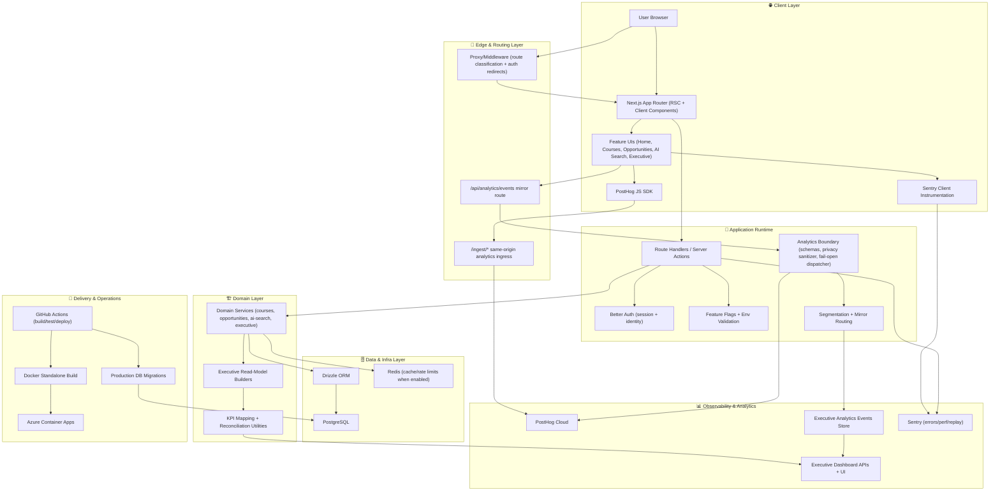

# 🚀 ScholarX

[](https://nextjs.org/)
[](https://www.typescriptlang.org/)
[](./.github/workflows/deploy-aca.yml)
[](./.github/workflows/deploy-worker-aca.yml)
[](./TESTING.md)
[](./ARCHITECTURE.md)
[](#-license)

🎯 ScholarX is an AI-powered scholarship and learning platform that helps learners discover high-fit opportunities and helps operators run the product with confidence through a production-grade executive analytics system.

## 🌍 Product Mission

ScholarX exists to reduce the time, uncertainty, and information gaps between learners and life-changing opportunities.

Our product mission is to:
- 🤖 Personalize discovery with AI-assisted search and ranking.
- 📈 Improve conversion from interest to application with clean UX and reliable funnel instrumentation.
- 🧭 Give leadership a trustworthy operating system (quality, growth, finance, technical health) via an executive dashboard.

## 🔗 Live Demo

- 🌐 Production: [https://scholar-x.org](https://scholar-x.org)
- 🛡️ Executive dashboard (auth/admin required): `https://scholar-x.org/admin/executive`

## 🖼️ Screenshots / GIFs

> Replace with project assets if not checked in yet.

- 🏠 Home: `docs/screenshots/home.png`
- 🧠 AI Search: `docs/screenshots/ai-search.gif`
- 🎓 Opportunities: `docs/screenshots/opportunities.png`
- 📊 Executive Dashboard: `docs/screenshots/executive-dashboard.png`

## 🧱 Architecture



## 🛠️ Tech Stack

### 🧩 Application
- Next.js 16 (App Router, Server Components)
- React 19
- TypeScript 5
- Tailwind CSS

### 🗄️ Data & Auth
- Better Auth
- Drizzle ORM
- PostgreSQL

### 📡 Observability & Analytics
- PostHog (same-origin ingestion proxy via `/ingest/*`)
- Sentry
- Internal executive analytics mirror

### ⚙️ Tooling
- pnpm
- ESLint
- Node test runner + `tsx`
- Playwright (E2E)
- Docker (standalone output)
- Azure Container Apps deployment workflows

## ✨ Main Features

- 🌐 Public scholarship/course discovery
- 🔐 Authenticated learner flows (profile, opportunities, AI search)
- 📌 Opportunity save/apply tracking
- 🤖 AI-assisted opportunity search
- 🧑‍💼 Admin + executive views
- 📈 Executive dashboard with sections for:
  - Overview
  - Public Growth
  - Opportunities & AI
  - Courses & Lessons
  - Users
  - Finance
  - Technical Health
  - Team Operations

## 📊 Production-Grade Analytics (What’s Implemented)

### ✅ Events currently tracked
- `website_visit`
- `cta_click`
- `signup_started`
- `signup_completed`
- `ai_search`
- `opportunity_apply_click`
- `opportunity_view` (PostHog only)
- `opportunity_save` (PostHog only)

### 🧠 Architecture highlights
- 🧼 Privacy sanitizer for forbidden keys
- 🛡️ Fail-open dispatch (analytics failures never block UX)
- ✅ Event schema validation
- 🧭 Mirror routing policy for KPI-critical events
- 📐 KPI mapping + reconciliation utilities
- 🔎 True-zero vs data-gap semantics in executive metrics

### 📚 Governance artifacts
See `specs/014-posthog-analytics-governance/`:
- event dictionary
- KPI mapping
- release checklist
- contract change-log template
- validation report

## 🗂️ Repository Layout

- `src/app/` route segments, layouts, route handlers
- `src/components/` reusable and feature UI
- `src/lib/` app libraries (auth, analytics, services)
- `src/domain/` business/domain layer and read models
- `src/db/` schema
- `specs/` product + implementation artifacts
- `.github/workflows/` deployment workflows

## 🧪 Local Setup

### 📦 Prerequisites
- Node.js 22+
- pnpm 10+
- PostgreSQL

### ⬇️ Install
```bash
pnpm install
```

### 🔧 Configure environment
Create `.env.local` and set required variables.

### 🗃️ Run migrations
```bash
pnpm db:migrate
```

### ▶️ Start dev server
```bash
pnpm dev
```

### ✅ Verify
Open [http://localhost:3000](http://localhost:3000)

## 🔐 Environment Variables

### 🌍 Public (build-time)
- `NEXT_PUBLIC_API_URL`
- `NEXT_PUBLIC_API_BASE_URL`
- `NEXT_PUBLIC_POSTHOG_KEY` (or `NEXT_PUBLIC_POSTHOG_PROJECT_TOKEN`)
- `NEXT_PUBLIC_POSTHOG_HOST`
- `NEXT_PUBLIC_POSTHOG_UI_HOST`
- `NEXT_PUBLIC_SENTRY_DSN`

### 🖥️ Server / Auth / Data
- `DATABASE_URL`
- `DATABASE_SSL`
- `BETTER_AUTH_URL`
- `BETTER_AUTH_SECRET`

### 🚩 Feature Flags (examples)
- `SCHOLARX_EXECUTIVE_DASHBOARD_ENABLED`
- `SCHOLARX_EXECUTIVE_TEAM_OPS_ENABLED`
- `SCHOLARX_EXECUTIVE_FINANCE_ENABLED`
- `SCHOLARX_EXECUTIVE_GOVERNANCE_ENABLED`
- `SCHOLARX_EXECUTIVE_AI_HEATMAP_ENABLED`
- `SCHOLARX_ANALYTICS_ENABLED`
- `SCHOLARX_ANALYTICS_INTERNAL_MIRROR_ENABLED`

### ⚡ Cache / Rate Limits
- `CACHE_ENABLED`
- `DISTRIBUTED_RATE_LIMITS_ENABLED`
- `REDIS_URL` or `AZURE_REDIS_*`
- `REDIS_KEY_PREFIX`

## 🗄️ Database & Migrations

Generate migration:
```bash
pnpm db:generate
```

Apply migration:
```bash
pnpm db:migrate
```

Push schema (non-prod workflows):
```bash
pnpm db:push
```

## 🧪 Testing Guide

Typecheck:
```bash
pnpm typecheck
```

Unit/integration tests:
```bash
pnpm test
```

API-focused tests:
```bash
pnpm test:api
```

E2E suite:
```bash
node --import tsx --test tests/e2e/**/*.spec.ts
```

## 🚢 Deployment Guide

### 🤖 CI/CD
- Web deploy workflow: `.github/workflows/deploy-aca.yml`
- Worker deploy workflow: `.github/workflows/deploy-worker-aca.yml`

### ⚠️ Build-time env requirement (critical)
`NEXT_PUBLIC_*` values must be present during Docker build.

Current workflow passes build args for:
- `NEXT_PUBLIC_SENTRY_DSN`
- `NEXT_PUBLIC_POSTHOG_KEY`
- `NEXT_PUBLIC_POSTHOG_PROJECT_TOKEN`
- `NEXT_PUBLIC_POSTHOG_HOST`
- `NEXT_PUBLIC_POSTHOG_UI_HOST`

### ☁️ Runtime
Deploys to Azure Container Apps with standalone Next.js output.

## 🔒 Security Notes

- 🚫 No secrets in client bundles.
- 🧼 Analytics payloads are sanitized before dispatch.
- 🛡️ Forbidden fields (tokens/secrets/password-like keys) are filtered.
- 🧭 Admin/internal paths are excluded from public growth analytics.
- 🔐 Auth boundaries preserved between public/auth/admin surfaces.

## 👨‍💻 My Role & Contributions

I led end-to-end engineering for core platform and analytics reliability, including:
- 🏗️ Product architecture and full-stack delivery across discovery, AI search, and opportunities.
- 📐 Production analytics governance system design and implementation.
- 🔁 PostHog ingestion hardening (same-origin `/ingest` strategy + middleware/proxy safety).
- 📊 KPI reconciliation and executive dashboard data integrity model.
- 🚀 CI/CD deployment improvements for build-time public env correctness.
- ✅ Test strategy spanning unit, integration, and E2E critical user journeys.

## 📈 Impact Metrics (Template)

> Replace with your latest validated numbers.

- Signup funnel completion rate: `+X%`
- Opportunity apply conversion: `+Y%`
- AI zero-result rate: `-Z%`
- Executive KPI reconciliation variance: `< 5%`
- Analytics delivery reliability: `>= 99%`

## ⚠️ Known Limitations

- Total registered users should be sourced from DB as the authoritative metric.
- Client-side events can still be impacted by user browser privacy extensions in edge cases.
- Some advanced analytics slices depend on instrumentation depth per surface.

## 🗺️ Roadmap

- [ ] Server-authoritative `user_created` event at auth boundary
- [ ] Advanced cohort retention dashboards
- [ ] Experimentation framework (A/B)
- [ ] Anomaly detection on executive KPIs
- [ ] Multi-tenant/org-level analytics segmentation

## 📄 License

Proprietary. All rights reserved.

## 🏅 Engineering Quality Evidence

- ✅ CI/CD workflows: `.github/workflows/deploy-aca.yml`, `.github/workflows/deploy-worker-aca.yml`
- ✅ Changelog: [CHANGELOG.md](./CHANGELOG.md)
- ✅ Release/tagging process: [RELEASES.md](./RELEASES.md)
- ✅ Testing strategy + E2E notes: [TESTING.md](./TESTING.md)
- ✅ Lint/typecheck/test commands: [ENGINEERING_QUALITY.md](./ENGINEERING_QUALITY.md)
- ✅ Security practices: [SECURITY.md](./SECURITY.md)
- ✅ Performance strategy + benchmark protocol: [PERFORMANCE.md](./PERFORMANCE.md)
- ✅ Planning artifacts: [ROADMAP.md](./ROADMAP.md), [GitHub issue template](./.github/ISSUE_TEMPLATE/feature_request.md)
- ✅ PR decision documentation: [PR template](./.github/pull_request_template.md)
