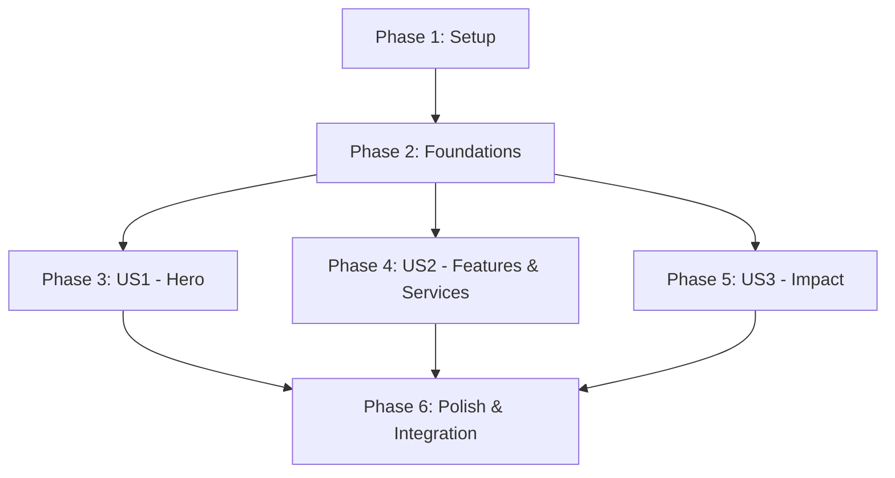

# Implementation Tasks: Premium Home Page Redesign

**Branch**: `002-home-page-ui`
**Implementation Plan**: `specs/002-home-page-ui/plan.md`

## Phase 1: Setup & Infrastructure
**Goal**: Initialize dependencies, shared data structures, and animation variants.

- [x] T001 Install `gsap` dependency via package manager in `c:\Users\dell\Documents\ScholarX\V2\web`.
- [x] T002 Create and implement `src/lib/home-data.ts` to export fully static `HOME_DATA` per `data-model.md`.
- [x] T003 Add new animation variants (`heroEntrance`, `sectionReveal`, `slideFromLeft`, `slideFromRight`) to `src/lib/motion-variants.ts`.

## Phase 2: Foundational Components
**Goal**: Create file structure and prepare the page shell.

- [x] T004 Create `src/components/home` directory and scaffold empty shell components: `hero-section.tsx`, `features-section.tsx`, `services-section.tsx`, `impact-section.tsx`, and `home-cta-section.tsx`.
- [x] T005 Setup the base `HomePage` layout in `src/app/page.tsx`, wrapping children in `<MotionConfig reducedMotion="user">` and adding updated `metadata`.

## Phase 3: User Story 1 - Discovering Core Value Proposition
**Goal**: Immediately communicate value through a visually stunning, parallax-driven hero section.
**Independent Test**: Page loads with a smooth stagger entrance; scrolling triggers multi-layer parallax depth via GSAP without scroll-jacking.

- [x] T006 [US1] Implement `<HeroSection>` in `src/components/home/hero-section.tsx` using GSAP ScrollTrigger (dynamic import) for parallax layers and Framer Motion for stagger entrance.
- [x] T007 [US1] Import and render `<HeroSection>` in `src/app/page.tsx` using `next/dynamic` with `ssr: false`.

## Phase 4: User Story 2 - Exploring Features and Services
**Goal**: Showcase platform features and target personas with Apple-quality visual hierarchy.
**Independent Test**: Scrolling down reveals the Features grid (staggered cards with 3D hover tilt) and Services layout (directional slide-ins).

- [x] T008 [P] [US2] Implement `<FeaturesSection>` in `src/components/home/features-section.tsx` using `StaggerContainer`, `Parallax3DWrapper`, and light `GlassCard`.
- [x] T009 [P] [US2] Implement `<ServicesSection>` in `src/components/home/services-section.tsx` featuring the "Why Choose" stagger list and "Who We Help" persona cards.
- [x] T010 [US2] Import and render `<FeaturesSection>` and `<ServicesSection>` in `src/app/page.tsx`.

## Phase 5: User Story 3 - Viewing Impact Metrics
**Goal**: Build trust through social proof and animated impact numbers.
**Independent Test**: Navigating to the Impact section triggers numbers to spring-animate from 0 to their final static values once.

- [x] T011 [US3] Implement `<ImpactSection>` in `src/components/home/impact-section.tsx` using Framer Motion `useSpring` for counter animations.
- [x] T012 [US3] Import and render `<ImpactSection>` in `src/app/page.tsx`.

## Phase 6: Polish & Cross-Cutting Concerns
**Goal**: Ensure end-to-end responsiveness, finalize the bottom CTA, and verify performance/accessibility.

- [x] T013 Implement `<HomeCTASection>` in `src/components/home/home-cta-section.tsx` matching the dark-frosted hero aesthetic.
- [x] T014 Import and render `<HomeCTASection>` at the bottom of `src/app/page.tsx`.
- [x] T015 Verify responsiveness (no horizontal scroll) and WCAG AA contrast across mobile, tablet, and desktop viewports.
- [x] T016 Audit reduced motion fallback behavior (GSAP disables, Framer respects config) and ensure Lighthouse performance score remains ≥ 90.

---

## Dependencies & Execution Order

## Parallel Execution Opportunities

- After **Phase 2**, US1 (`HeroSection`), US2 (`FeaturesSection` / `ServicesSection`), and US3 (`ImpactSection`) can be implemented completely in parallel.
- Within US2, `<FeaturesSection>` (T008) and `<ServicesSection>` (T009) can be built concurrently.

## Implementation Strategy

1. **MVP First**: Execute Phase 1, Phase 2, and Phase 3 to deliver a working Hero Section. This represents the most critical first impression and highest technical complexity (GSAP integration).
2. **Incremental Polish**: Build the remaining sections (US2, US3, Polish) independently as pure React component tasks, integrating them one-by-one into the main `page.tsx` shell.
